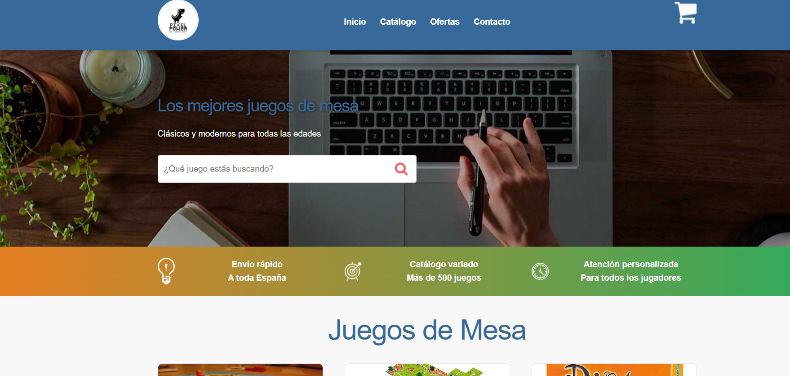

🛒 Carrito de Compras – Juegos de Mesa

Aplicación web para gestionar un carrito de compras interactivo en una tienda de juegos de mesa.

📋 Descripción

Proyecto desarrollado como práctica personal para reforzar JavaScript moderno.  
Esta aplicación permite a los usuarios agregar, eliminar y visualizar productos en un carrito de compras, con cálculo automático del total.

🚀 Características

✅ Añadir productos al carrito  
✅ Incremento de cantidades al añadir un producto repetido  
✅ Eliminar productos individuales  
✅ Vaciar el carrito completo  
✅ Cálculo automático del total  
✅ Interfaz sencilla y fácil de usar  

🛠️ Tecnologías Utilizadas

- HTML5 – Estructura del proyecto  
- CSS3 – Estilos personalizados  
- JavaScript (ES6+) – Lógica de la aplicación  
- DOM Manipulation – Interacción dinámica con elementos  

📁 Estructura del Proyecto
Proyecto-Carrito/  
│  
├── css/  
│   └── custom.css      # Estilos personalizados  
├── img/                # Imágenes de los productos y logo  
├── js/  
│   └── app.js          # Lógica principal de la aplicación  
├── index.html          # Página principal  
└── README.md           # Documentación del proyecto  

🎯 Conceptos de JavaScript Aplicados

- Manipulación del DOM  
- Event Listeners  
- Arrays y objetos literales  
- Funciones flecha  
- Template literals  

🌐 Demo en Vivo

🔗 *[Próximamente en Netlify]*  

🚀 Instalación y Uso

Opción 1: Ejecutar Localmente  

1. Clona el repositorio  
   ```bash
   git clone https://github.com/albertocll/Proyecto-Carrito.git
   cd Proyecto-Carrito

Abre el archivo index.html en tu navegador
(o usa la extensión Live Server en VS Code)

💡 Cómo Usar la Aplicación

Añade productos al carrito haciendo clic en el botón correspondiente

Visualiza el carrito con los productos seleccionados

Elimina productos individuales o vacía el carrito completo

Observa el total actualizado automáticamente

🎓 Objetivos de Aprendizaje

Manipulación dinámica del DOM

Uso de funciones y arrays en JS

Manejo de eventos del usuario

Buenas prácticas de código limpio

📄 Licencia

Este proyecto es de uso personal y educativo.

👤 Autor

Alberto – GitHub

⭐ ¡Dale una estrella al proyecto si te gustó! ⭐

📸 